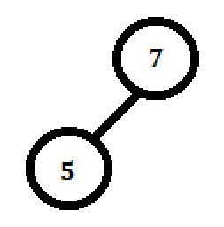
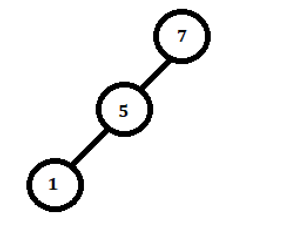
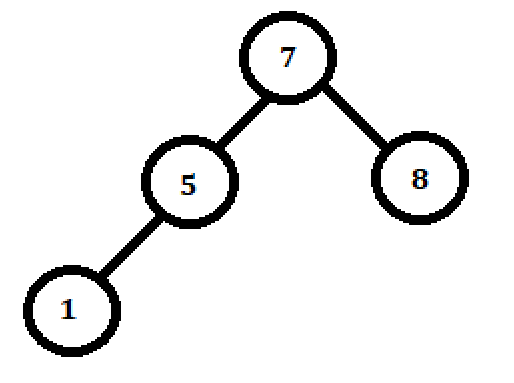
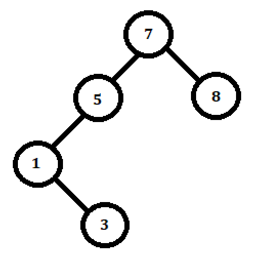
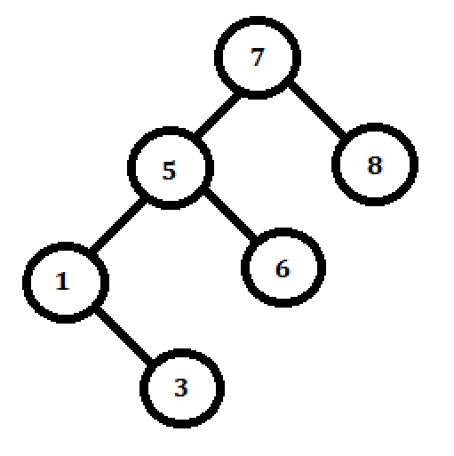
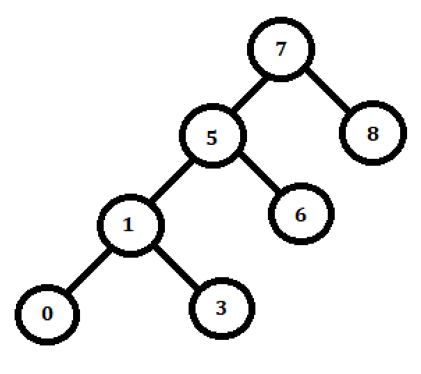
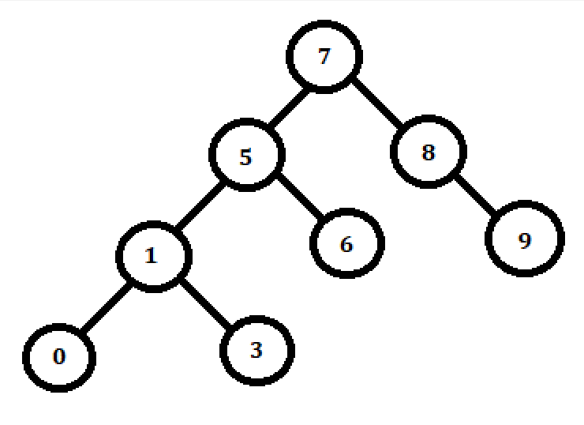
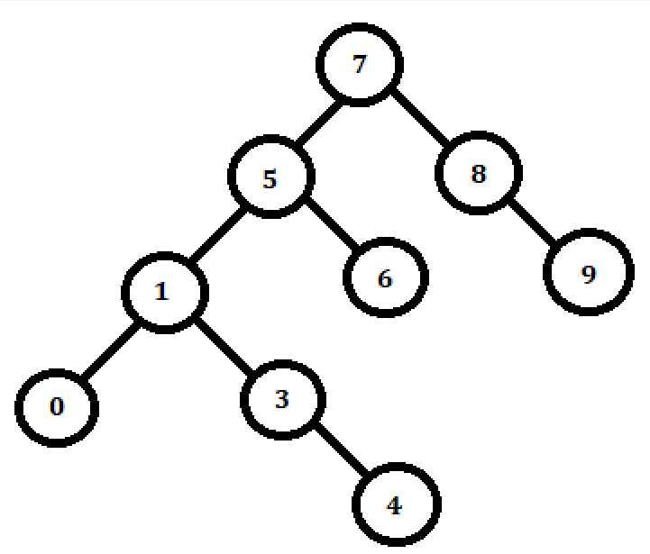
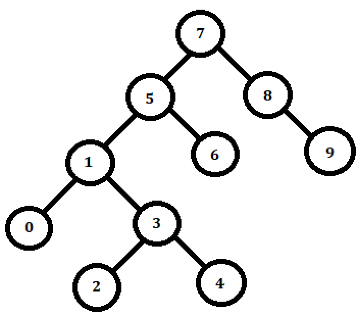

# binary-search-tree

#### front end patikası merge-sort projesi

[patika.dev,](https://www.patika.dev/tr)

#### [7,5,1,8,3,6,0,9,4,2]

- Dizisinin Binary - search - tree aşamalarını yazınız

###### 1.adım

###### 2.adım

###### 3.adım

###### 4.adım

###### 5.adım

###### 6.adım

###### 7.adım

###### 8.adım

###### 9.adım

